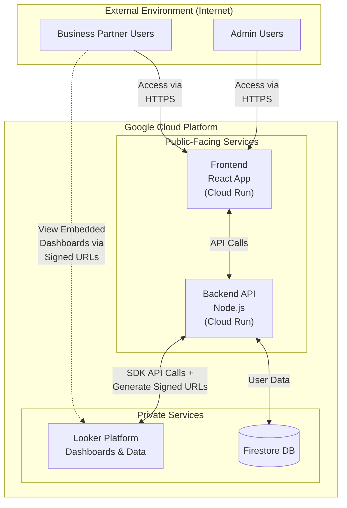

# Looker Portal

A customizable web application with RBAC and JWT authentication controls that enables secure external access to Looker dashboards hosted on a private Looker instance via Looker embed URLs.


## 📋 Table of Contents

- [Overview](#overview)
- [Features](#features)
- [Architecture](#architecture)
- [Prerequisites](#prerequisites)
- [Setup Instructions](#setup-instructions)
  - [Google Cloud Setup](#google-cloud-setup)
  - [Looker Configuration](#looker-configuration)
  - [Local Development](#local-development)
  - [Database Initialization](#database-initialization)
  - [Production Deployment](#production-deployment)
- [Usage Guide](#usage-guide)
- [Troubleshooting](#troubleshooting)
- [Security Considerations](#security-considerations)
- [License](#license)

## 🔍 Overview

The Looker Portal is a web application that provides a secure way for organizations to share Looker dashboards with their business partners without giving them direct access to their private Looker instance. The application uses Looker's embedding capabilities to display dashboards within a custom interface, with role-based access control and easy dashboard assignment to specific business partners.

The portal consists of a React frontend and a Node.js backend, using Firestore for data storage and Looker's embedding capabilities for dashboard visualization.

## ✨ Features

- **User Authentication**: Secure login with JWT-based authentication and token refresh
- **Role-Based Access Control**: Admin and user roles with appropriate permissions
- **Business Partner Management**: Create and manage business partners
- **User Management**: Admins can create, update, and delete users
- **Dashboard Assignment**: Assign specific Looker dashboards to business partners
- **Dashboard Viewing**: Users can view dashboards assigned to their business partner
- **Export Options**: Export dashboards as Excel or PDF

## 🏛️ Architecture

The application follows a modern, microservices-based architecture:



Key components:
- **Frontend**: React application with ShadCN UI components and TailwindCSS
- **Backend**: Node.js REST API with Express
- **Database**: Firestore for storing user, business partner, and configuration data
- **Authentication**: JWT-based authentication with refresh tokens
- **Deployment**: Google Cloud Run for both frontend and backend services

## 📋 Prerequisites

Before you begin, ensure you have:

- **Google Cloud Account** with billing enabled
- **Looker Instance** with administrator access
- **Node.js** 18.x or higher
- **npm** or **yarn** package manager
- **Google Cloud CLI** installed and configured

## 🚀 Setup Instructions

### Google Cloud Setup

1. **Create a new Google Cloud Project**:
   ```bash
   gcloud projects create looker-portal --name="Looker Partner Portal"
   gcloud config set project looker-portal
   ```

2. **Enable required APIs**:
   ```bash
   gcloud services enable cloudbuild.googleapis.com \
                          run.googleapis.com \
                          firestore.googleapis.com \
                          artifactregistry.googleapis.com \
                          secretmanager.googleapis.com
   ```

3. **Create a Firestore database**:
   ```bash
   gcloud firestore databases create --region=us-central1
   ```

### Looker Configuration

1. **Create a dedicated API user**:
   - Log in to your Looker instance as an administrator
   - Navigate to **Admin > Users**
   - Create a new user with email like `looker-portal-api@yourdomain.com`
   - Set appropriate permissions (see [Looker Portal Configuration Guide](looker-portal-configuration.md))

2. **Create API3 credentials**:
   - In the API user profile, go to the **Authentication** tab
   - Under **API3 Keys**, click **New API3 Key**
   - Save the Client ID and Client Secret securely

3. **Enable embedding**:
   - Navigate to **Admin > Embed**
   - Enable "Embedded Access"
   - Generate a new Embed Secret
   - Add your application's domains to the "Allowed Embed Domains" list
     - For local: `http://localhost:5173`
     - For production: Your deployed domain

### Local Development

1. **Clone the repository**:
   ```bash
   git clone https://github.com/yourusername/looker-portal.git
   cd looker-portal
   ```

2. **Install dependencies**:
   ```bash
   npm install
   cd frontend && npm install
   cd ../backend && npm install
   ```

3. **Set up backend environment variables**:
   Create a `.env` file in the backend directory:
   ```
   PORT=8080
   FRONTEND_URL=http://localhost:5173
   JWT_SECRET=your_jwt_secret_here
   REFRESH_TOKEN_SECRET=your_refresh_token_secret_here
   LOOKER_HOST=your-looker-instance.cloud.looker.com
   LOOKER_EMBED_SECRET=your_looker_embed_secret_here
   USE_MOCK_LOOKER=false
   ```

4. **Set up Looker SDK configuration**:
   Create a `looker.ini` file in the backend directory:
   ```ini
   [Looker]
   base_url=https://your-looker-instance.cloud.looker.com
   client_id=your_client_id
   client_secret=your_client_secret
   verify_ssl=true
   ```

5. **Set up frontend environment variables**:
   Create a `.env` file in the frontend directory:
   ```
   VITE_API_URL=http://localhost:8080
   VITE_LOOKER_HOST=your-looker-instance.cloud.looker.com
   VITE_USE_MOCK_LOOKER=false
   VITE_APP_NAME="Looker Partner Portal"
   VITE_APP_NAME_LOWER="looker-portal"
   ```

6. **Start the development servers**:
   ```bash
   # In the root directory
   npm run dev
   ```
   
   This will start both frontend and backend servers concurrently.

### Database Initialization

Before you can use the application, you need to initialize the database with an admin user:

1. **Run the initialization script**:
   ```bash
   cd backend
   node initialize-db.js
   ```

   This script will:
   - Create an initial admin business partner
   - Create an admin user with the following credentials:
     - Email: `admin@example.com`
     - Password: `admin123`
   - Create a test business partner and user

   If you want to modify the default initialization, edit the `initialize-db.js` file before running it.

2. **Verify initialization**:
   Check the console output to ensure the script executed successfully. You should see output similar to:
   ```
   Created business partner with ID: [partner-id]
   Created admin user with ID: [user-id]
   Database initialized successfully!
   ```

### Production Deployment

#### Using Cloud Build

The repository includes a `cloudbuild.yaml` file for deploying to Google Cloud Run using Cloud Build:

1. **Create a Cloud Build trigger**:
   ```bash
   gcloud builds triggers create github \
     --name="looker-portal-deploy" \
     --repo="yourusername/looker-portal" \
     --branch-pattern="main" \
     --build-config="cloudbuild.yaml"
   ```

2. **Set substitution variables**:
   Set these variables in your Cloud Build trigger:
   - `_LOOKER_HOST`: Your Looker instance URL
   - `_LOOKER_EMBED_SECRET`: Your Looker embed secret
   - `_JWT_SECRET`: A secure random string for JWT signing
   - `_REFRESH_TOKEN_SECRET`: A secure random string for refresh tokens
   - `_USE_MOCK_LOOKER`: `true` or `false` depending on if you're using Looker
   - `_APP_NAME`: Display name for your app
   - `_APP_NAME_LOWER`: Lowercase, hyphenated name for resources
   - `_DEPLOY_REGION`: GCP region (e.g., `us-central1`)

3. **Trigger a build**:
   Push to your main branch or manually trigger the build.

## 📘 Usage Guide

### Admin Users

After logging in as an admin:

1. **Manage Business Partners**:
   - Navigate to the Admin Panel > Business Partners tab
   - Create new business partners
   - Assign Looker dashboards to partners

2. **Manage Users**:
   - Navigate to the Admin Panel > Users tab
   - Create new users
   - Assign users to business partners
   - Set user roles (admin or regular user)

### Regular Users

After logging in as a regular user:

1. **View Dashboards**:
   - See a list of available dashboards assigned to your business partner
   - Select a dashboard to view

2. **Export Data**:
   - Use the Excel or PDF export options to download dashboard data

## 🔧 Troubleshooting

### Common Issues

1. **CORS Errors**:
   - Ensure the `FRONTEND_URL` in the backend `.env` file matches your frontend URL exactly
   - Check that your Looker instance has the correct domains in the embed allowlist

2. **Authentication Issues**:
   - Verify that JWT_SECRET values match between environment and application
   - Check for expired tokens

3. **Looker Embedding Issues**:
   - Verify your Looker instance is properly configured for embedding
   - Check that the business partner has dashboards assigned

4. **Database Connection Issues**:
   - Ensure you have the correct permissions for Firestore
   - Verify that the database exists in the specified region

### Debugging

- **Backend logs**: Check logs with `gcloud logging read "resource.type=cloud_run_revision AND resource.labels.service_name=looker-portal-backend"`
- **Frontend logs**: Check browser console and network requests
- **Enable debug mode**: Set `DEBUG=looker:*` in the backend environment variables

## 🔐 Security Considerations

1. **Secrets Management**:
   - In production, use Google Cloud Secret Manager instead of environment variables
   - Use `gcloud secrets create` to create secrets and reference them in Cloud Run

2. **API Security**:
   - The application uses JWT with refresh tokens
   - Passwords are hashed with bcrypt before storage
   - Rate limiting is applied to login attempts

3. **Firestore Security Rules**:
   - Implement proper security rules as defined in the `firebase-config.txt` file

4. **Regular Updates**:
   - Keep all dependencies updated to mitigate security vulnerabilities:
     ```bash
     npm audit fix
     ```

## 📄 License

This project is licensed under the MIT License - see the LICENSE file for details.