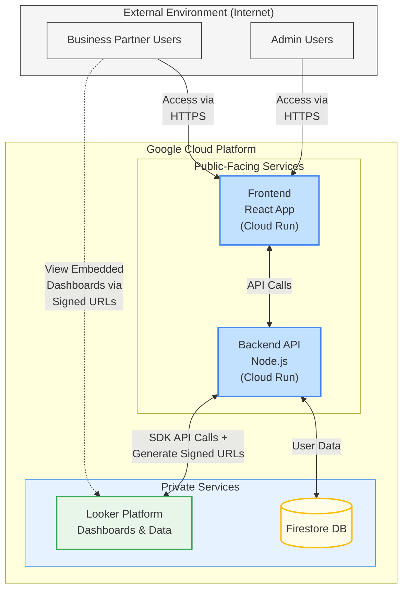

```mermaid
flowchart TB
    subgraph ExtUsers["External Environment (Internet)"]
        BPUsers["Business Partner Users"]
        AdminUsers["Admin Users"]
    end

    subgraph GCP["Google Cloud Platform"]
        subgraph PublicServices["Public-Facing Services"]
            Frontend["Frontend\nReact App\n(Cloud Run)"]
            Backend["Backend API\nNode.js\n(Cloud Run)"]
        end
        
        subgraph PrivateServices["Private Services"]
            Firestore[(Firestore DB)]
            Looker["Looker Platform\nDashboards & Data"]
        end
    end
    
    %% Connections
    BPUsers -->|"Access via\nHTTPS"| Frontend
    AdminUsers -->|"Access via\nHTTPS"| Frontend
    
    Frontend <-->|"API Calls"| Backend
    Backend <-->|"User Data"| Firestore
    Backend <-->|"SDK API Calls +\nGenerate Signed URLs"| Looker
    
    BPUsers -.->|"View Embedded\nDashboards via\nSigned URLs"| Looker
    
    %% Styles
    classDef external fill:#f5f5f5,stroke:#333,stroke-width:1px
    classDef publicService fill:#c2e0ff,stroke:#4285F4,stroke-width:2px
    classDef privateService fill:#e6f2ff,stroke:#4285F4,stroke-width:1px
    classDef database fill:#fffde7,stroke:#FBBC05,stroke-width:2px
    classDef looker fill:#e8f5e9,stroke:#34A853,stroke-width:2px
    
    class ExtUsers,BPUsers,AdminUsers external
    class Frontend,Backend publicService
    class PrivateServices privateService
    class Firestore database
    class Looker looker
```